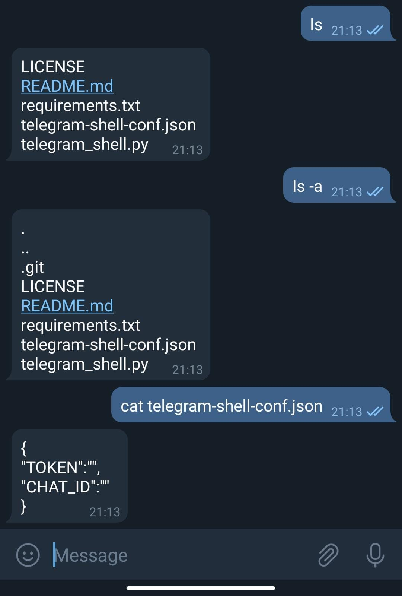

# Remote Telegram shell
> This is a program that uses Telegram to interact with a remote machine executing any command. You **don't need** the ip addres of the machine you want to connect to.

## Prerequisites
* [Get a Telegram Bot and a Token](https://core.telegram.org/bots)
* Python 3
* pip3

## Installation
Once you have the token and the id of the chat you want to use to interact with the bot

Clone the repository
```bash
https://github.com/adrihacar/remote-telegram-shell.git
```
Copy the file configuration file to the path specified in the script
```bash
cd remote-telegram-shell
mkdir -p $HOME/.config/telegram-shell && cp ./telegram-shell-conf.json $HOME/.config/telegram-shell
```

Fill the configuration file with the TOKEN and the CHAT ID
```
{
"TOKEN":"",
"CHAT_ID":""
}
```

Install all the dependencies
```bash
pip3 install -r requirements.txt
```

## Usage

You can run this script in background and redirect the standard output
```bash
./telegram_shell.py  >/dev/null &
```
Open your telegram conversation and enjoy :)



## Contributing

Contributions are what make the open source community such an amazing place to learn, inspire, and create. Any contributions you make are **greatly appreciated**

1. Fork the Project
2. Create your Feature Branch (`git checkout -b feature/AmazingFeature`)
3. Commit your Changes (`git commit -m 'Add some AmazingFeature'`)
4. Push to the Branch (`git push origin feature/AmazingFeature`)
5. Open a Pull Request

## License

Distributed under the GPL-3.0 License. See `LICENSE` for more information.

## Contact

Adrián Hacar Sobrino - [@adrihacar](https://twitter.com/adrihacar)


